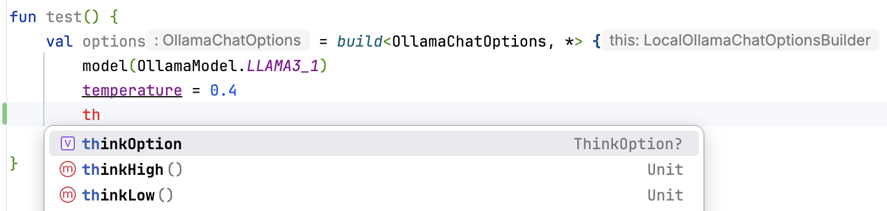

# Buider Lambda Kotlin plug-in 

> Java builders, the way Kotliners like them

The [builder pattern](https://projectlombok.org/features/Builder) is very common in the Java world.
However, using them in Kotlin usually leads to non-idiomatic code.

```kotlin
Config.builder().hostname("localhost").port(8080).build()
```

Using this compiler plug-in, you get a much nicer syntax,

```kotlin
import com.serranofp.builder.lambda.build

build<Config, *> {  // alas, the * is needed
    hostname = "localhost"
    port = 8080
}
```

**Apply the plug-in**.
Simply add it to your `plugins` block in your Gradle file,

```kotlin
id("com.serranofp.builder.lambda") version "<current-release>"
```

and import `com.serranofp.builder.lambda.build` whenever you need to use a builder.

Although the plug-in requires a supporting library for the `build` function,
this is a _compile-only_ dependency. The plug-in rewrites the call using `build`
to a sequence of calls on the builder, without any additional runtime dependency.

**IDE support**.
You can get autocompletion and diagnostics right in IntelliJ
if you allow compiler plug-ins from outside the Kotlin Team to run.
To do so, go to _Help_ > _Edit Custom Properties..._, and add the following line
to the file that opens:

```properties
kotlin.k2.only.bundled.compiler.plugins.enabled=false
```

Restart your IDE, and enjoy.



## Features

**Required arguments.**
Arguments required for the initial call to `build` are turned into _required_
arguments. Those required arguments must be present, and must  be given at 
the very beginning of the block, before anything else is set.
The plug-in reports errors otherwise, ensuring that builder calls are correct.

**Singular for collections.**
When the type of a property is a collection type, builders sometimes
provide [singular methods](https://projectlombok.org/features/Builder#singular)
for more quickly adding a value. The plug-in is aware of this pattern,
and exposes those as functions, instead of as setters.

```java
// 'authors' is a List<String>
Book.builder().title("Wow!").author("me").author("you").build()
```

```kotlin
build<Book, *> {
    title = "Wow!"
    author("me")
    author("you")
}
```

**`set`/`opt` naming convention.**
Some projects (like [DJL](https://djl.ai/)) follow a slighly different
convention for their builders, with `setXXX` marking required arguments,
and `optXXX` marking optional ones.
The plug-in also supports that convention.